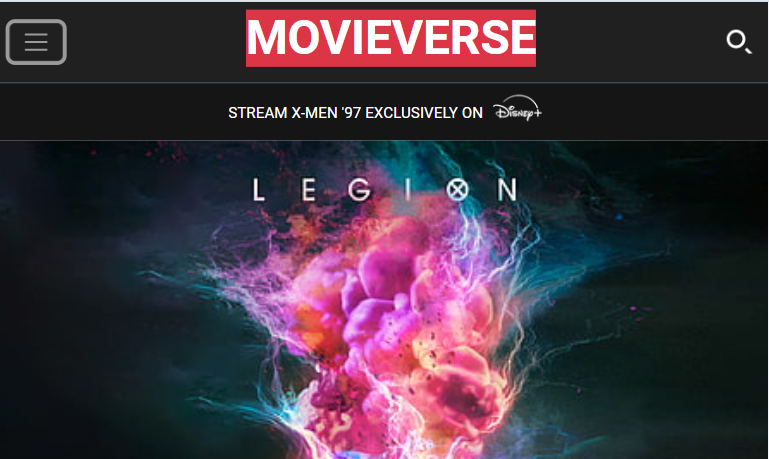

## MOVIEVERSE

MOVIEVERSE is a single-page web component designed to provide a sleek and dynamic user experience for exploring movies, comics, games and tv shows.It incorporates a header, navbar, main, footer, an background carousal with overlay text and proper hovering and scaling effect to make the design look lively, smooth and beautiful. The web page is created using html, css and bootstrap. This web page is completely reponsive for mobile, table, large and ultra-large screens.

### Deployed Link

[Live Demo](https://cosmic-boba-518430.netlify.app/)

### Screenshots

#### Mobile View

#### Tablet View

#### Desktop View

## Features

- **Header nad Navbar**: A completely responsive design of which consister navigation bar and autoplay carousal having overlay text over it which includes buttons and also social media links.
- **Dynamic Design**: A single-page component with fluid layout adjustments to accommodate different screen sizes, ensuring a seamless user experience for mobile, tablet and desktop users.
- **Carousal with Overlay Text**: Many carousal is added throughtout the page like in header and inside the main content having many cards contains image and overlay text.
- **Clipped Border Button**: Border design of the button created using clippath to give it look of parellelogram.
- **Responsive Hamburger Menu**: Ensures accessibility and ease of navigation on smaller devices.
- **Responsive Footer**: Ensures that all the other details and social media links should be properly visible to small, medium and large screens.

## Tech Stack

- **HTML**: Provides the structure and content for the web page.
- **CSS**: Handles the UI and styling, ensuring an appealing visual presentation.
- **Bootstrap**: Implements functionality navbar, caraousals, buttons, colors, font size, and responsive design layout.

### Design Elements

1. **Navbar**
   Bootstrap is utilized to ensure the navbar responsiveness across various screen sizes. By adjusting the layout and styling dynamically, the navbar offers an optimal viewing experience on different devices.

2. **Carousals with overlay text or multiple image and text cards**
   Carousals with overlay text are employed to create captivating design and look within the website. By defining specific proper containers, able to show overlay text over the carousals image those overlay text contains text and buttons which are responsive and gives seamless user experience to all device.

3. **Overlay:**
   The overlay feature is integrated to enhance the visual presentation of images. By adding a translucent layer over images, overlay improves readability and focus, making text content more prominent and appealing.
   
5. **Responsive Design:**
  Utilizes bootstrap's responsive functionalites such grid and flex layouts to adapt the page layout across various devices, ensuring a seamless browsing experience on mobile phones, tablets, and desktop computers.

6. **Fonts & Icons:**
  Integrates Google Fonts and FontAwesome icons for enhanced typography and visual elements. By leveraging these resources, the website achieves a modern and visually appealing design, improving readability and user engagement.

7. **Effects and Hovering:**
   A proper effects and hovering effect is used to throughout the web page to make consistent, lively, smooth and interactive.

## How to Use

To run this project locally:

1. Clone this repository to your local machine.
2. Open the `index.html` file in your preferred web browser.
3. Explore the MOVIEVERSE experience right from your device.

## Contributors
   
<a href="https://github.com/aniyant">sunny kumar</a>    <a href="https://github.com/Akash2304">Akash Rajpoot</a>    <a href="https://github.com/mr-taqi">Syed</a>
         <a href="https://github.com/rajatsah95">rajat kumar</a>     <a href="https://github.com/Chaitali124">chaitali</a>    <a href="https://github.com/uk70">vishal</a>
   

## License

This project is licensed under GNU GENERAL PUBLIC LICENSE - see the [LICENSE](LICENSE) file for details.

## Acknowledgments

- Inspired by the beauty of travel and exploration.
- Special thanks to the supportive community at [MOVIEVERSE].

